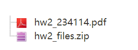
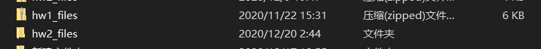
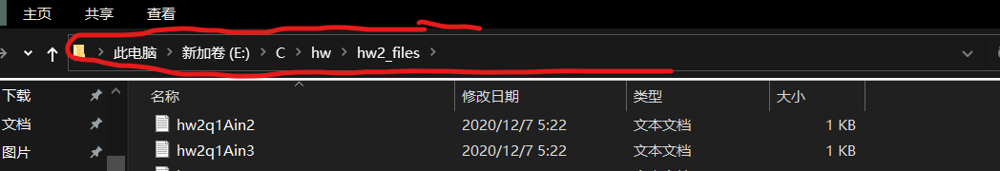
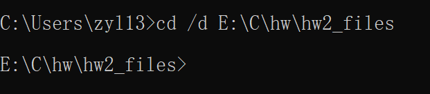
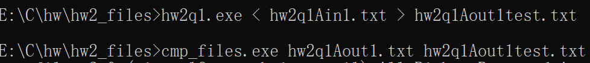

# GT-MCS-INT_computer_science-HW & guide of cmp_files
## This repository is a public shared for the CS HW,if you have more efficient code,I would update it,hope it can help us

#### The following is a guide of how to use cmp_files.

**Why cmp_files?**

  It is a file given by Prof. Israel for us to check our output txt.It can compare two txt files and display "identical" if they are the same or "different from which line and which column" if they are not exactly the same.

**where?**

You can find it on moodle page.

Click to download.Maybe your computer's firewall or third-party anti-virus software will report a dangerous signal.Never mind,just accept it.

**How to use it?**

Well , now you have downloaded "cmp_files.exe" successfully.And you also need to download the HW folder which is a zip-type folder from moodle page.

Once you have downloaded it,one **important** thing here is that you need to unpacked the zip folder.(By right click it and click unpacked .The reason here is that cd command can not access zip-type folder).  

Then,you need to put com_files.exe in the HW folder(unpacked one),make sure you have compiled your program which will create xxx.exe in your current folder.Now , copy your folder path by click the red zone of your window and copy it.  
  

And then open cmd,run the following command in order to access your current folder.

*cd /d (paste path here)*

now you can run your program and import example's input and save your output as another txt,and we will compare it with standard output.
run the following command

*xxx.exe < xxxin.txt > xxxouttest.txt*
*cmp_files.exe xxxout.txt xxxouttest.txt*

Then we would see the result of comparasion.
